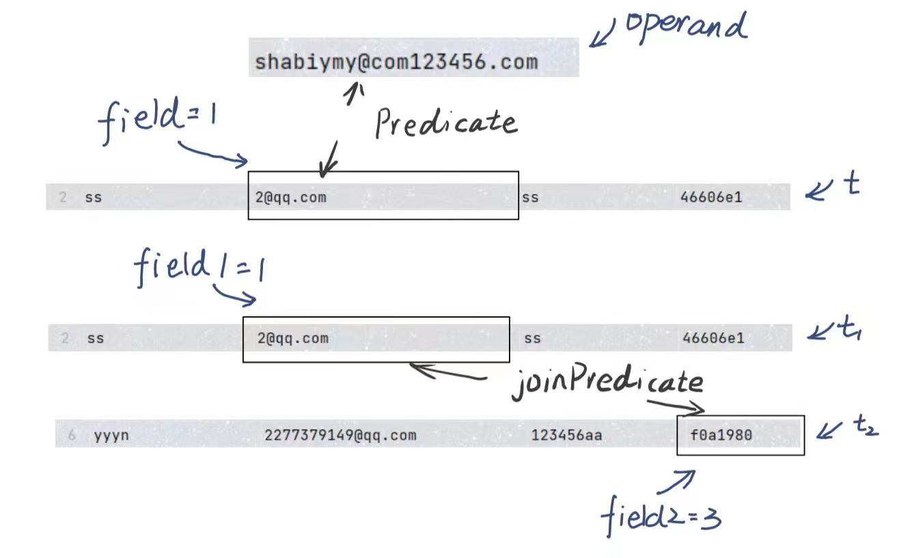

# MIT 6.830日寄-lab2

## 前言

​	不容易啊， 终于吧 lab2 完成了， 不过感觉其实做的不算慢，可能国庆的时候一直在做吧....

​	有一说一，总体来说， lab2 相对于 lab1 代码量上升了不少， 而且也有了可以优化的点，比如说 Join 的优化以及缓冲池的淘汰法则等等。

​	完成了 lab2 也不断的加深了我对于 MIT 6.830 中迭代器的理解，【小小吐槽一下：这个 lab 每做完一个部分，一测试全报错，一 debug 才发现全是 lab1 的锅...】

​	感谢贡献自己笔记的前辈们，他们的奉献给了我许多帮助...

​	我的项目地址 ：https://github.com/yyym-y/MIT6.830  【star， star，star ！！【发癫】】

​	lab1 笔记 ： [MIT 6.830日寄-lab1 - 知乎 (zhihu.com)](https://zhuanlan.zhihu.com/p/658169665)

​	更好的笔记地址 ： [https://github.com/yyym-y/note/](https://link.zhihu.com/?target=https%3A//github.com/yyym-y/note/tree/master/%E6%95%B0%E6%8D%AE%E5%BA%93/MIT6.830)

## Exercise 1

你需要完成 `Predicate`  类，`JoinPredicate` 类， `Filter` 类和  `Join`  类，文件地址为 ：

* src/java/simpledb/execution/Predicate.java
* src/java/simpledb/execution/JoinPredicate.java
* src/java/simpledb/execution/Filter.java
* src/java/simpledb/execution/Join.java

当你完成几个类的时候，你可以通过 PredicateTest ,  JoinPredicateTest ,  FilterTest ,  JoinTest ；

同时你也应该通过  systemtest / FilterTest 和 systemtest / JoinTest

-----

首先我们要先知道 `Predicate`  类和 `JoinPredicate` 类这都是用来进行比较的，只不过比较的内容和方式有所区别

* Predicate ： 给定 Field ， 比较某一个 Tuple 的 指定列和这个 Field 的关系
* JoinPredicate ： 比较 Tuple1 的 列1 与 Tuple2 的 列2 之间的关系

搞清楚了这个，这两个类就手到擒来啦，自然你就可以通过前两个测试。

 `Filter` 类和  `Join`  类大家可以理解为对大量数据的封装：

* `Filter` 类 是对 `Predicate`  类的进一步封装

  正常来说 `Predicate`  类只能实现对一个 Tuple 进行操作，但是 `Filter` 类可以对许多个 Tuple 进行操作，其内部原理是使用一个迭代器来传递Tuple， 然后再使用 `Predicate`  类对这一个 Tuple 进行判断

* `Join`  类 是对 `JoinPredicate` 类的进一步封装

  与 `Filter` 类同理， 不过因为每次比较都涉及两个 Tuple， 所以就存在两个迭代器

知道了这点，大家应该就可以完成这两个类了，不过 Join 类存在大量的优化空间， 所以大家感兴趣可以移步到下面这篇文章来查看：

PS ：有几点教训希望大家可以注意

* 本节的迭代器都是继承自 `Operator` 类， 所以open的时候需要同时开启 `Operator` , 因为在之后的测试过程中，是直接调用 `Operator` 的 next 方法的， 如果没有将 `Operator` 打开会报 `IllegalStateException("Operator not yet open")`
* 打开的代码为 `super.open()`
