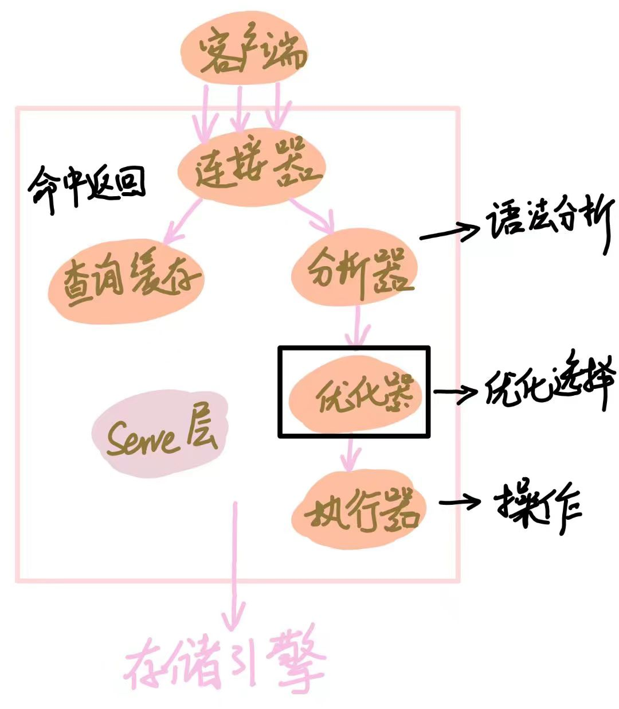
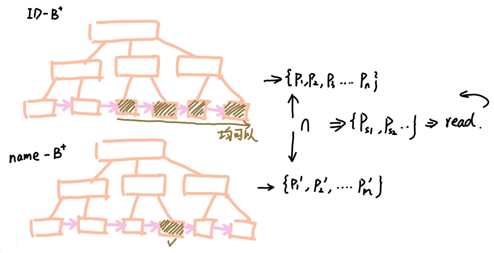
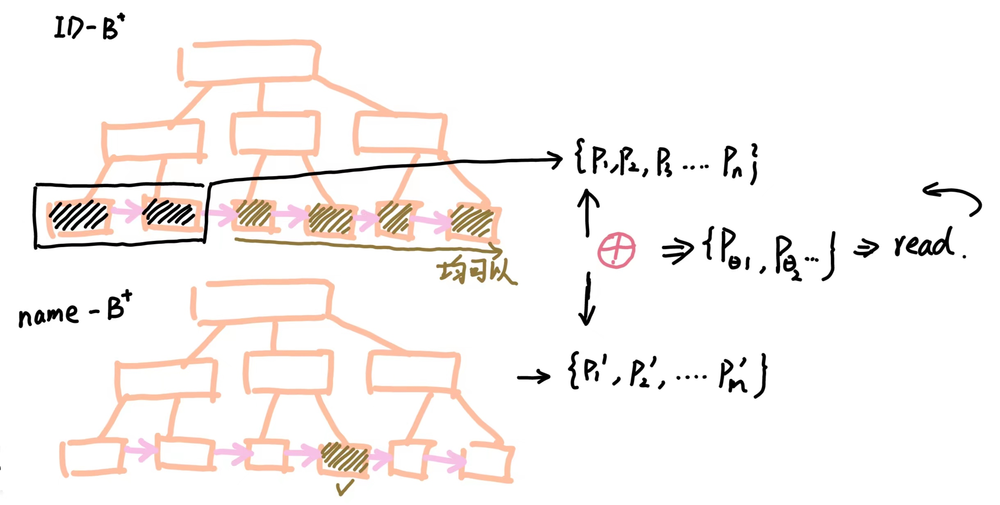
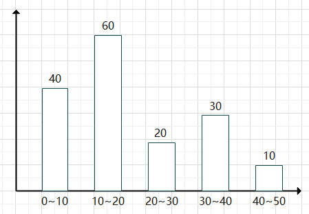

# MIT 6.830日寄-lab3


## 前言

这个 Lab3 做的真的痛苦..... 作为数据库组成原理的纯小白，写查询优化写的真的莫名其妙....

简述完成前后的心路历程：

1. 做完 Exercise 1， Exercise 2 ：莫名其妙的就过了，我干了什么？？？为什么这样写？？？
2. Exercise 3： ？？？ 这是什么，我是什么？？？
3. Exercise 4 ：什么鬼？？？怎么那么长？？？
4. 开始写 Exercise 4 ：怎么写？？？ 为什么 MLE 和 TLE ？？？

所以我打算在最开始就吧需要的知识以及体系讲出来， 希望能让一脸懵逼的你有所改观

感谢贡献笔记的前辈们

GitHub 仓库 ：https://github.com/yyym-y/MIT6.830

知乎笔记：

* Lab1 : https://zhuanlan.zhihu.com/p/658169665
* Lab2 : https://zhuanlan.zhihu.com/p/660173608


## 整体框架以及思路

这里给出我搜集资料后觉得很不错的资料：

* [MIT6.830-2022-lab3实验思路详细讲解_幸平xp的博客-CSDN博客](https://blog.csdn.net/weixin_45938441/article/details/128447702)
* [[南湾提款机\] MIT 6.830 数据库系统 lab3_哔哩哔哩_bilibili](https://www.bilibili.com/video/BV1HN4y1d7t7/?spm_id_from=333.880.my_history.page.click)
* [数据库第9章 关系查询的处理与优化（第一部分：处理算法与效率计算）_哔哩哔哩_bilibili](https://www.bilibili.com/video/BV1yg411J7fi/?spm_id_from=333.788&vd_source=8838e4a19bf1a6234c3eef010864f3cf)

---

首先我们要先知道一条 SQL 语句的执行顺序是什么样的， 基本步骤如下：



而我们 Lab3 所要实现的就是分析器这个部分

你可能会觉得， 这怎么能优化，所有查询的条件都是固定好的，这怎么能够优化？

----


1. 我们先思考如何**在一张表**中寻找信息：


我们首先了解一下两种寻找 Tuple 的方法：

* 全表扫描算法 （Table Scan）

  > 我们将这整一个表分块读入到内存中，然后扫面这张表上的所有的 Tuple， 寻找我们需要的 Tuple

* 索引扫描方法 （Index Scan）

  > 利用 B+ 树索引或者 Hash 索引， 先找到满足条件的 Tuple 主码， 再通过元组指针精确寻找

是个人都知道索引扫描方法都更加优秀，而全表扫描算法只适合小表

>PS : 如果你学完了 Mysql， 你会发现 Mysql 不会主动建立索引， 需要你主动建立
>
>并且索引是针对一个字段来建立的， 所以 **判断要查询的字段是否有索引 ** 也是优化器要考虑的

为了你能更好的理解上面的两个扫描算法，我们拿下面的 SQL 语句作为演示：

```sql
SELECT * FROM students WHERE name="yyym";
```

如果你采用全表扫描，你就需要将 `students` 表全部读完

而使用 Hash 索引， 你就能快速定位到这个 `name="yyym"` 的 Tuple 在磁盘的具体位置， 从而快速读出


2. 如果这个时候条件增多， **将表的数量增加一张**：


```sql
SELECT * FROM students WHERE name="yyym" && id > 10;
```

> 这个时候其实就已经变成了多表连接，只不过另一张表是自己本身

我们同样可以通过索引来优化查询

只需要现查询出两个条件对应的指针【两个列都有索引】 然后取交集[1]，或者根据指针找出对应的 Tuple， 之后再对两组 Tuple 取交集【只有一个列有索引】[2]

用图像表示如下图所示：



注意，其实到现在还有可以优化的地方，我们注意到：符合 `id > 10` 的指针远远大于不符合的指针数量，所以我们可以采用一个相反的思维 ：

我们把不符合的条件找出来， 如果这个时候 `name="yyym"` 的索引包含在了这些不符合的条件内，我们就将其删掉。 用下面的图表示就是 ：




3. 继续增加表的数量 $\to \infty$


如果你有一些分治的思想的话，可以这么想，再多张表也可以拆成无数个【两张表相合并】的情况

但是，具体的顺序是什么呢？不同的顺序会产生什么影响呢？

我们先来了解以下本次 Lab 的优化器类型是什么：

本 Lab 的优化器类型是 **基于代价的优化器** , 我们先来介绍这个：

* **基于代价的优化器（Cost Based Optimizer， CBO）**

  > 在坚持实事求是原则的基础上，通过对具有现实意义的诸多要素的分析和计算来完成最优路径的选择工作。代价即为SQL执行的代价。成本越低，SQL执行的代价越小，CBO也就认为是一个更优异的执行路径

我们要了解一下一条 Mysql 语句执行的代价都有些什么：

* 集中式数据库【即我们现在所写】
  * 磁盘存取块数 【I / O 代价】
  * 处理机时间 【CPU 代价】
  * 查询的内存开销

> 所有代价最重要最主要的代价是 **I / O 代价**

为了大家能够更加直观的理解顺序对代价的影响，我们假设现在有这样两张表：

* `Student` 表

  > 一共有 $10000$ 条记录
  >
  > 包含以下字段： `name` 姓名 ； `course_id` 课程id

* `course` 

  > 一共有 $50$ 条记录
  >
  > 包含以下字段： `course_id` 课程id ； `teacher` 教授老师姓名

执行以下的 SQL 语句 ： 【求教授老师是 “yyym” 的同学的姓名】

```sql
SELECT student.name 
FROM student, course 
WHERE student.course_id = course.course_id && course.teacher = "yyym";
```

就上面的这段 SQL 语句我们可以翻译成下面的关系代数：

1. $Q_1 = \pi_{S_{\mathrm{name}}}[\sigma_{S.\mathrm{cid} = C.\mathrm{cid} \and C.\mathrm{tea} = \mathrm{yyym}}(\mathrm{Student \times Course})]$

   > 这个方案就是嵌套循环， 即把笛卡尔积找出来，然后依次判断

2. $Q_2 = \pi_{S_{\mathrm{name}}}[\sigma_{C.\mathrm{tea} = \mathrm{yyym}}(\mathrm{Student}\bowtie\mathrm{Course})]$

   > 让两个表根据 `course_id` 字段做自然连接， 接着在筛选出 `teacher="yyym"` 的字段

3. $Q_3 = \pi_{S_{\mathrm{name}}}[\mathrm{Student}\bowtie\sigma_{C.\mathrm{tea} = \mathrm{yyym}}(\mathrm{Course})]$

   > 先筛选 Course 表， 只留下 `teacher="yyym"` 的信息，之后再根据 `course_id` 字段做自然连接

* [注] 根据某个字段做自然连接

  > 某个字段相等才连接成一个表， 否则不连接

我们其实很容易就可以看出第三种方式实际上是更优秀的，应为它去除了许多无用的 Tuple

> 可以数学证明，证明过程在最开始的 B站视频，我懒得写了.....

所以在多表 Join 的情况下，Join 的顺序也很重要， **所以我们要找出那个最优顺序**

---


**如何具体实现优化的过程**

我们还是按照之前的思路， 从两张表说起， 再逐步的推广到多张表

---

**明确代价**

<div id="3.1"></div>

优化最重要也是最基础的一步就是明确 **代价**， 我们如何计算这个代价呢？

我们先要获取以下两个参数：

1. 扫描整张表的代价 【用来估计全表扫描的代价】
2. 符合某个条件的 Tuple 的数量是多少 【索引扫描会返回所有符合条件的索引，所以要统计有多少个符合】

首先要明确一点，我们不可能获取精确的值，我们只能获取粗略的值

我们采用直方图的形式来计算出每一列的信息，现在我们假设某一列的统计信息如下：



现在我们要预测这一列值为 $17$ 的值大概有多少个：

我们先定位到 $17$ 所在的范围 为 $10\sim 20$ 内， 这个区间总共有 $60$ 个数字， 其中包含了 $10$ 个数字， 所以我们预估这一列值为 $17$ 一共有 $\frac{60}{10} = 6$ 个

同理， 我们也可以估计所有运算符的统计数据。同时我们也可以计算出这张表所有列的统计信息。

接下来就是获得扫描整张表的代价，这个还算简单，我们直接将这张表扫描一遍就知道了

计算扫描代价的公式为 ： $\mathrm{PageNum \times IOCostPage}$ ， 即这张表页的数量 $\times$ 读取这一页的 IO 成本

同时我们也会统计整个表中 Tuple 的数量， 即 TupleNum， 我们之后叫基数

-----


**两表连接的代价**

<div id="3.2"></div>

为了方便表述， 我们假设现在有两个表 $\mathrm{Table1}$ 和 $\mathrm{Table2}$

我们可以根据之前的统计得到以下的信息：

* $\mathrm{Table1} : \mathrm{card1} , \mathrm{cost1}$		// card1 ： 表一预估返回的 Tuple 数量， cost1：扫描全表的代价
* $\mathrm{Table2} : \mathrm{card2} , \mathrm{cost2}$        // card2 ： 表二预估返回的 Tuple 数量， cost2：扫描全表的代价

我们分别考虑三种连接方式的代价：

1. LoopJoin 循环连接

   > 我们先要将表一读到内存中， 即有一次表一的全表扫描  $\mathrm{cost1}$
   >
   > 对于表一的每一个符合条件的 Tuple， 我们都要扫描一边表二， 所以代价为 ： $\mathrm{card1 \times cost2}$
   >
   > 每找到一对符合条件的Tuple1 和 Tuple2 都要做一次自然连接，所以代价为 ：  $\mathrm{card1 \times card2}$
   >
   > 所以总的代价为 ： $\mathrm{cost1 + card1\times cose2 + card1 \times card2}$

2. HashJoin 哈希连接 （Equal 专属）

   > 首先将两张表读入并计算哈希散列表  $\mathrm{cost1 + cost2}$
   >
   > 再读一次表一, 并一一计算哈希值  $\mathrm{cost1}$
   >
   > 每找到一对符合条件的Tuple1 和 Tuple2 都要做一次自然连接，所以代价为 ：  $\mathrm{card1 \times card2}$
   >
   > 所以总的代价为 ： $\mathrm{cost1 + cost2 + cost1 + card1 \times card2}$

3. MergeSortJoin

   > 首先将两张表读入 ， 代价为 $\mathrm{cost1 + cost2}$  【假定原先有序】
   >
   > 使用 MergeSort的方式依次滑动， 无需计算代价
   >
   > 每找到一对符合条件的Tuple1 和 Tuple2 都要做一次自然连接，所以代价为 ：  $\mathrm{card1 \times card2}$
   >
   > 所以总的代价为 ： $\mathrm{cost1 + cost2 + card1 \times card2}$
   >
   > > 如果无序还要考虑排序的代价


如此，我们便能量化不同的连接代价


**多表连接的最优代价计算**

<div id="3.3"></div>

我们已经能算出两张表连接的代价了，接下来就是如何寻找最优的连接组合代价了

我们采用**动态规划**的思想来实现这一寻找过程

我们定义一个节点 $p$ 来表示有两张表进行连接， 我们假设一共有 $n$ 个节点 $\{p_1, p_2,\dots,p_n\}$

我们定义 $dp$ 方程式为 $dp[\{p_i, p_{i+1}, \dots p_j\}]$ 代表集合 $\{p_i, p_{i+1}, \dots p_j\}$ 的最佳代价是多少

那么我们的 $dp$ 方程转移式就可以写成：
$$
dp[\{p_i, p_{i+1}, \dots p_j\}] = \min \{ dp[\{p_i, p_{i+1}, \dots, p_{k-1}, p_{k+1},\dots,p_j\}] + \mathrm{Cost_{k \bowtie \mathrm{Table}}}\} \quad k \in [i,j]
$$
实际上就是对于一个集合，我们从集合中挑出一个节点，然后判断这个节点与之前的最优解之间连接后的代价

之后取最小值就可以了

-----


## Exercise 1

你需要完成 `IntHistogram`  类，文件地址为 ：

* src/java/simpledb/optimizer/IntHistogram.java

当你完成这个类的时候，你可以通过 IntHistogramTest；

---

这个类实际上就是之前介绍的直方图的统计规则，我们需要不断的统计每个列的信息：[这里](#3.1)


原理以及作用之前介绍了，我们简单介绍一下如何优化计算，

最简单的方法是使用前缀和取快速获取值，但是每添加一个元素，就需要重新计算一次前缀和，有些时候会十分的繁琐，所以我们可以使用树状数组去优化


## Exercise 2

你需要完成 `TableStats`  类，文件地址为 ：

* src/java/simpledb/optimizer/TableStats.java

当你完成这个类的时候，你可以通过 TableStatsTest;

----

这个类的作用是对这张表的每一列都构建上述所说的 Histogram

值得注意的是：如果 Field 类型是 IntField， 则对应 IntHistogram， 否则为 StringHistogram

我们要获取这张表的信息，并扫描两遍

第一遍用来确定最大值和最小值， 第二遍用来构建 Histogram

一个小 tip ： https://zhuanlan.zhihu.com/p/660849426


## Exercise 3

你需要完成 `JoinOptimizer`  类的两个函数 `estimateJoinCost()` `estimateJoinCardinality()`，文件地址为 ：

* src/java/simpledb/optimizer/JoinOptimizer.java

当你完成这个类的时候，你可以通过 estimateJoinCostTest 和 JoinOptimizerTest 的 estimateJoinCardinality 测试;

---

计算代价之前讲过，在这里 : [这里](#3.2)

代码如下：

```java
public double estimateJoinCost(LogicalJoinNode j, int card1, int card2,
                               double cost1, double cost2) {
    if (j instanceof LogicalSubplanJoinNode) {
        // 这里不写也行，不用理解为什么
        return card1 + cost1 + cost2;
    } else {
        // 我这仅仅只写了循环扫描的代价
        return cost1 + card1 * cost2 + card1 * card2;
    }
}
```

```java
public int estimateJoinCardinality(LogicalJoinNode j, int card1, int card2,
                                   boolean t1pkey, boolean t2pkey, Map<String, TableStats> stats) {
    if (j instanceof LogicalSubplanJoinNode) {
		// 这里同样不用实现
        return card1;
    } else {
        // 调用之前写好的函数
        return estimateTableJoinCardinality(j.p, j.t1Alias, j.t2Alias,
                                            j.f1PureName, j.f2PureName, card1, 											   card2, t1pkey, t2pkey,stats, 												p.getTableAliasToIdMapping());
    }
}
```


## Exercise 4

你需要完成 `JoinOptimizer`  类的 `orderJoins()`，文件地址为 ：

* src/java/simpledb/optimizer/JoinOptimizer.java

当你完成这个类的时候，你可以通过 JoinOptimizerTest

除此之外还需通过 systemtest / QueryTest

----


具体的实现原理如上：[这里](#3.3)

注意，源代码中寻找所有子集的方法的时间复杂度为 $n!$ ， 比较糟糕

所以我们优化为 $2^n$ ， 我们使用二进制搜索来确定：

```java
public HashMap<Integer, List<Set<LogicalJoinNode>>> 		getMap(List<LogicalJoinNode> join) {
    int len = join.size();
    HashMap<Integer, List<Set<LogicalJoinNode>>> map = new HashMap<>();
    for(int i = 1 ; i < (1 << len) ; i++) {
        Set<LogicalJoinNode> now = new HashSet<>();
        int numEle = 0;
        for(int j = 0 ; j < len ; j ++) {
            int num = i >> j & 1;
            if (num == 1) {
                numEle ++; now.add(join.get(j));
            }
        }
        map.computeIfAbsent(numEle, k -> new ArrayList<>());
        map.get(numEle).add(now);
    }
    return map;
}
```

完整的动态规划代码如下：

```java
public List<LogicalJoinNode> orderJoins(
    Map<String, TableStats> stats,
    Map<String, Double> filterSelectivities, boolean explain)
    throws ParsingException {
    HashMap<Integer, List<Set<LogicalJoinNode>>> map = getMap(this.joins);
    PlanCache pc = new PlanCache();
    CostCard costCard = null;
    for(int i = 1 ; i <= joins.size() ; i++) {
        List<Set<LogicalJoinNode>> subset = map.get(i);
        for(Set<LogicalJoinNode> set : subset) {
            double minCost = Double.MAX_VALUE;
            for(LogicalJoinNode removeNode : set) {
                CostCard cc = computeCostAndCardOfSubplan(
                    stats, filterSelectivities, removeNode, set,
                    minCost, pc
                );
                if(cc != null) {
                    minCost = cc.cost;
                    costCard = cc;
                }
            }
            if(minCost != Double.MAX_VALUE) {
                pc.addPlan(set, minCost, costCard.card, costCard.plan);
            }
        }
    }
    if(costCard != null)
        return costCard.plan;
    return joins;
}
```


## 尾声

终于结束了.....

这个 lab 代码量不多， 但为了看懂也花了不少的时间， 不断的查资料， 问学长， 看代码....

如果没记错的话下一个 Lab 是事务...

不想说话了，就这样....
