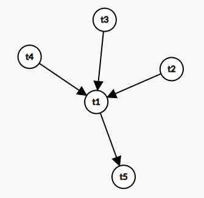
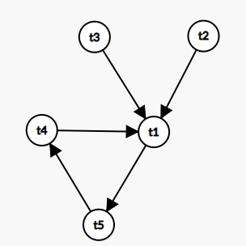

# MIT 6.830日寄-lab4


## 前言

​		这个 lab 完成的还是很痛苦的，主要是来自 Java 的多线程以及对于锁何时释放何时等待何时抛出异常十分的混乱，所以这个 lab 前前后后写了有三次之久，所以代码量还是很大的...

​		在完成 lab4 期间，也参加了别的活动，人生第二次公费旅游 ： 去沈阳参加 CCSP 比赛， 只能说纯纯坐牢，从早上九点坐到晚上九点，顺便吐槽一下中餐和晚餐的盒饭好难吃....但学姐好美啊哈哈

​		之后参加了 CNCC，会是一次没开，饭是一餐不落 [不好吃...] ， 不过也是可惜，沈阳天气不冷，才 7° ，还指望能看到雪来着.....

​		扯远了... 回来准备打广告：

* MIT6.830 专栏笔记 ： [MIT 6.830 系列 - 知乎 (zhihu.com)](https://www.zhihu.com/column/c_1694677664919777281)
* Github 仓库地址 ：https://github.com/yyym-y/MIT6.830

* 笔记 PDF 版 ： https://github.com/yyym-y/MIT6.830/tree/master/note

## 前置知识

首先我们要先明白什么是 **二阶段锁协议**

* 二阶段锁协议

  > 整个事务在同一个时候获取锁， 在同一个时候释放锁
  >
  > 也就是说只要开始释放锁了，那么就不能再获取锁了
  >
  > 在本 lab 中，我们释放锁基本在事务提交或者回滚的时候释放


接着我们需要知道我们是如何**实现事务的回滚以及提交**的

我们回忆起在每一个 Page 中都有一个脏位 [`dirty`] ，如果被标记为脏， 那么这一页就被没有提交过的事务写过

不过我们肯定不能直接在磁盘中操作， 我们会将脏页保存在缓冲池中， 我们的写操作都是对缓冲池中的 Page 进行操作的， 当然标脏也是将缓冲池的页标脏

如果我们提交了某个事务， 我们就在缓冲池中寻找被这个事务影响而标脏的 Page， 然后将它写入磁盘保存并将缓冲池的那个 Page 标志为干净

如果我们回滚了某一事务，同理，找出缓冲池中寻找被这个事务影响而标脏的 Page, 然后将它丢弃即可

同时缓冲池也要配合，不在将标脏的页面驱逐出去， 如果你发现缓冲池中没有干净的页面可以被驱逐的时候，你要抛出错误

​		

最后就是理解什么是 **死锁**

* 死锁

  > 两个事务因为都想要获取对方持有的锁而陷入相互等待的情况中
  >
  > 上面的解释其实不全，大家可以自行搜索
  >
  > 为了方便你快速理解，我们举个例子
  >
  > > 事务 t1 拥有 p1 的锁， 准备获取 p2 的锁， 事务 t2 拥有 p2 的锁， 准备获取 p1 的锁
  > >
  > > 应为他们需要的锁被其他事务拥有， 所以需要等待持有的事务释放
  > >
  > > 又因为二段锁协议， 所以 t1 等待 t2 ， t2 等待 t1， 从而死循环

了解了死锁，我们思考如何如何来预防死锁

我们采用构建一个 **有向图** 来解决

我们现在假设事务 t1 要等待事务  t2, t3， t4 完成， t5 要等待事务 t1 完成， 我们就可以构建出一下的有向图：



如果这个是否发现 t4 需要等待 t5 完成，这个时候有向图就变成了 ：



我们发现这个时候图中是存在环的， 所以就会存在死锁， 所以我们没有办法，所以只能直接将 t4 回滚

至于如何判断时候有环，我相信你们数据结构一定学的比我好...

目前 DFS 和拓扑排序是主流选择，当然更好的选择也可以


## LockManager 类

我们需要实现一个锁管理器来判断是否加锁还是等待亦或者抛出错误，所有逻辑都会在这个上面展示

只要完成了这个类， 大部分的测试就可以通过了，我们一步步来讲解：

### 准备工作

我们首先来实现一个工具类 `PageLock`

```java
public static class PageLock {
    private PageId pid; // 记录这个页锁锁住的 Page 的 id
    private Permissions lockType; // 记录锁住这个页的锁的我类型，记录是读锁还是写锁
    public PageLock(PageId pid, Permissions lockType) {...}
    public PageId getPid() {...}
    public Permissions getLockType() {...}
    public void setLockType(Permissions prem) {...}
    @Override
    public int hashCode() {
        // 注意： 哈希值只是用了 pid 的哈希值，没有使用锁类型的哈希值
        return pid.hashCode();
    }
    @Override
    public boolean equals(Object o) {
        // 比较也只是比较 pid， 没有比较锁类型
        if(o == null) return false;
        if(o.getClass() != getClass()) return false;
        PageLock other = (PageLock) o;
        return pid.equals(other.getPid());
    }
    @Override
    public String toString() {...}
}
```

注意细节：**不会比较锁的类型，只比较pid**

所以以后寻找 PageLock 的时候只会判断 pid 是否相等


判环所必须要的 `DirectedGraph` 也是必不可少的

```java
public static class DirectedGraph {
    ConcurrentHashMap<TransactionId, HashSet<TransactionId>> graph 
        = new ConcurrentHashMap<>();
    public synchronized void addNode(TransactionId tid) {...}
    public synchronized void addEdge(TransactionId tid1, TransactionId tid2) {...}
    public synchronized void removeNode(TransactionId tid) {...}
    public synchronized void removeEdge(TransactionId tid1, TransactionId tid2) {...}
    // 判断是否有环
    public synchronized boolean ifCircle() {...}
}
```


同时我们也需要一些工具来记录当前不同的页以及事务的信息

```java
// 获取这个 Page 对应的所有没有提交的事务 ID
private final ConcurrentHashMap<PageId, HashSet<TransactionId>> pageIdToTran 
    = new ConcurrentHashMap<>();
// 获取这个事务曾经获得过的所有页级锁
private final ConcurrentHashMap<TransactionId, HashSet<PageLock>> tranToPageId 
    = new ConcurrentHashMap<>();
// 获取这个页当前被几个页面拥有了读锁
volatile ConcurrentHashMap<PageId, Integer> readNum = new ConcurrentHashMap<>();
// 判断这个页是否被某个页面拥有了写锁
volatile ConcurrentHashMap<PageId, Boolean> ifWrite = new ConcurrentHashMap<>();
volatile DirectedGraph g = new DirectedGraph();
```

同时为了让代码看着更优雅，也封装了一些基本操作，这些无关紧要

```java
public synchronized void addRead(PageId pid) { readNum.merge(pid, 1, Integer::sum); }
public synchronized void delRead(PageId pid) { readNum.merge(pid, -1, Integer::sum); }
public synchronized Integer getReadNum(PageId pid) {         				
    if(readNum.get(pid) == null) return 0;
    return readNum.get(pid);
}
public synchronized void setWrite(PageId pid) { ifWrite.put(pid, true); }
public synchronized void setUnWrite(PageId pid) { ifWrite.put(pid, false); }
public synchronized Boolean getIfWrite(PageId pid) {
    if(ifWrite.get(pid) == null) return false;
    return ifWrite.get(pid);
}
```


### 加锁操作

我们先来看看总体的框架

```java
public synchronized void addLock(PageId pid, TransactionId tid, Permissions prem) 
    throws TransactionAbortedException {
    // 这个页面现在被哪些事务拿着锁
    HashSet<TransactionId> pageOfTran = pageIdToTran.get(pid); 
    
    // 如果这个页面当前没有给任何事务拿到任何锁
    if(pageOfTran == null) {
        notLockBefore(pid, tid, prem);
    } else {
    // 我想申请读锁， 但这个页面被某些事务拿到了某些锁
        if(prem.equals(Permissions.READ_ONLY)) {
            addReadLock(pid, tid);
        } else {
     // 我想申请写锁， 但这个页面被某些事务拿到了某些锁
            addWriteLock(pid, tid);
        }
    }
}
```


我们先来看看最简单的情况 ： *这个页面当前没有给任何事务拿到任何锁*

这个时候我们直接去加上这个锁就好了，并且记录相关信息， 值得注意的是，如果申请的是写锁， 要标记为被写，如果是读锁， 那么持有该页面锁的事务数量要增加

```java
public synchronized void notLockBefore(PageId pid, TransactionId tid, Permissions prem) {
    // 记录这个页已经被这个事务拿到锁了
    pageIdToTran.put(pid, new HashSet<>(List.of(new TransactionId[]{tid})));
    // 记录这个事务已经拿到了这个页的锁
    if(tranToPageId.get(tid) == null)
        tranToPageId.put(tid, 
                    new HashSet<>(List.of(new PageLock[] {new PageLock(pid, prem)})));
    else
        tranToPageId.get(tid).add(new PageLock(pid, prem));
    if(prem.equals(Permissions.READ_WRITE))
        setWrite(pid);
    else addRead(pid);
}
```


接下来分析一下稍微复杂的情况： *申请读锁， 但这个页面被某些事务拿到了某些锁*

我们进一步细分一下

1. 当前申请这个锁的事务原本就拥有这个页的锁，那么其实可以直接返回

   * 如果原本拥有的是读锁 ： 毫无疑问，原本就有，无需再加

   * 如果原本拥有的是写锁 ：写锁的另外一面是可读可写，实际上包含了读锁，所以不用再加

2. 当前申请这个锁的事务原本就没有这个页的锁

   > 我们首先要明白一个页拥有的锁只会有下面两种形式
   >
   > * $[\mathrm{READ\_WRITE]}$ 
   > * $[\mathrm{READ\_ONLY}, \mathrm{READ\_ONLY},\mathrm{READ\_ONLY} \dots\dots]$
   >
   > 即要么全是读锁，要么只有一个写锁
   >
   > 如果全部是读锁， 那么直接加锁就可以了， 如果只有一个写锁， 那么就需要等待写锁释放

```java
public synchronized void addReadLock(PageId pid, TransactionId tid) 
    throws TransactionAbortedException {
    // 这个页面现在被哪些事务拿着锁
    HashSet<TransactionId> pageOfTran = pageIdToTran.get(pid); 
    if(pageOfTran.contains(tid)) // 如果这个页面被这个事务已经拿了锁了， 直接返回
        return;
    // 否则，就需要判断是否等其他事务的锁释放，值得注意的是，如果申请的是读锁，那么需要等写锁释放
    TransactionId first_tid = pageIdToTran.get(pid).iterator().next();
    if(getIfWrite(pid))
        g.addEdge(first_tid, tid);
    if(g.ifCircle()) {
        // 如果有环产生， 那么代表有死锁
        if(getIfWrite(pid))
            g.removeEdge(first_tid, tid);
        throw new TransactionAbortedException();
    }
    while (getIfWrite(pid)) {
        try {
            this.wait();
        } catch (InterruptedException e) {
            throw new RuntimeException(e);
        }
    }
    addRead(pid);
    pageIdToTran.computeIfAbsent(pid, k -> new HashSet<>());
    pageIdToTran.get(pid).add(tid);
    tranToPageId.computeIfAbsent(tid, k -> new HashSet<>());
    tranToPageId.get(tid).add(new PageLock(pid, Permissions.READ_ONLY));
}
```


接下来分析一下最复杂的情况： *申请写锁， 但这个页面被某些事务拿到了某些锁*

1. 当前申请这个锁的事务原本就拥有这个页的锁

   * 如果这个事务已经拿着这个页的写锁

     > 直接返回即可

   * 如果只有事务拿着这个页的读锁

     > 将它的读锁直接升级为写锁即可

   * 如果不止这个事务拿着这个页的读锁

     > 需要等同样拿着这个页读锁的事务释放这写读锁，这个时候要判断死锁


```java
public synchronized void updateReadToWrite(PageId pid, TransactionId tid) 
    throws TransactionAbortedException {
    for(PageLock plk : tranToPageId.get(tid)) {
        if(plk.getPid().equals(pid) && plk.getLockType().equals(Permissions.READ_ONLY)) {
            tranToPageId.get(tid).remove(new PageLock(pid, Permissions.READ_ONLY));
            tranToPageId.get(tid).add(new PageLock(pid, Permissions.READ_WRITE));
            delRead(pid); setWrite(pid);
            return;
        }
    }
    throw new TransactionAbortedException();
}
public synchronized void addWriteLockButUpdate(PageId pid, TransactionId tid) 
    throws TransactionAbortedException {
    HashSet<TransactionId> pageOfTran = pageIdToTran.get(pid); // 这个页面现在被哪些事务拿着锁
    HashSet<PageLock> tranOfPage = tranToPageId.get(tid); // 这个事务现在拿着哪些页的锁
    // 刚好我自己拿着写锁
    if(getIfWrite(pid) && getReadNum(pid).equals(0))
        return;
    // 只有我一个人拿着读锁
    if(getIfWrite(pid).equals(Boolean.FALSE) && getReadNum(pid).equals(1)) {
        updateReadToWrite(pid, tid); return;
    }
    // 不止我一个人拿着读锁
    for(TransactionId first_tid : pageOfTran) {
        // 要等待除了我自己的其他事务完成
        if(first_tid.equals(tid)) continue;
        g.addEdge(first_tid, tid);
    }
    if(g.ifCircle()) {
        for(TransactionId first_tid : pageOfTran) {
            if(first_tid.equals(tid)) continue;
            g.removeEdge(first_tid, tid);
        }
        throw new TransactionAbortedException();
    }
    while (! getReadNum(pid).equals(1)) {
        try {
            this.wait();
        } catch (InterruptedException e) {
            throw new RuntimeException(e);
        }
    }
    updateReadToWrite(pid, tid);
    setWrite(pid);
}
```


2. 当前申请这个锁的事务原本没有这个页的锁
   * 等待所有其他拥有这个页的读锁，写锁的事务释放，要判断死锁

```java
public synchronized void addWriteLockButNone(PageId pid, TransactionId tid) 
    throws TransactionAbortedException {
    HashSet<TransactionId> pageOfTran = pageIdToTran.get(pid);
    for(TransactionId first_tid : pageOfTran) {
        g.addEdge(first_tid, tid);
    }
    if(g.ifCircle()) {
        for(TransactionId first_tid : pageOfTran) {
            g.removeEdge(first_tid, tid);
        }
        throw new TransactionAbortedException();
    }
    if(getReadNum(pid) !=  null && ! getReadNum(pid).equals(0)) {
        try {
            this.wait();
        } catch (InterruptedException e) {
            throw new RuntimeException(e);
        }
    }
    setWrite(pid);
    pageIdToTran.computeIfAbsent(pid, k -> new HashSet<>());
    pageIdToTran.get(pid).add(tid);
    tranToPageId.computeIfAbsent(tid, k -> new HashSet<>());
    tranToPageId.get(tid).add(new PageLock(pid, Permissions.READ_WRITE));
}
```


### 释放锁操作

释放锁相比于加锁简单了不少， 我们主要将其分为了三类， 不讲解了， 比较简单

* 释放某一个事务对应的所有锁 `releaseTidLock`
* 释放某一个事务下的某一个锁【不安全】 `releaseExactLock`
* 释放全部锁 `releaseAllLock`

```java
public synchronized void releaseTidLock(TransactionId tid) {
    HashSet<PageLock> tranOfPage = tranToPageId.get(tid);
    for(PageLock plk : tranOfPage) {
        if(plk.getLockType().equals(Permissions.READ_ONLY)) {
            delRead(plk.getPid());
        }else
            setUnWrite(plk.getPid());
        pageIdToTran.get(plk.getPid()).remove(tid);
        if(pageIdToTran.get(plk.getPid()).isEmpty())
            pageIdToTran.remove(plk.getPid());
    }
    g.removeNode(tid);
    tranToPageId.remove(tid);
    notifyAll();
}
public synchronized void releaseExactLock(TransactionId tid, PageId pid) {
    // 这里没有对计数器递减， 因为操作本身就是不安全的
    pageIdToTran.get(pid).remove(tid);
    tranToPageId.get(tid).remove(new PageLock(pid, null));
    notifyAll();
}
public synchronized void releaseAllLock() {
    pageIdToTran.clear(); tranToPageId.clear();
    readNum.clear(); ifWrite.clear(); g = new DirectedGraph();
    notifyAll();
}
```


## Exercise 1 ~ 5

只需要在缓冲池中所有获取锁以及更新的操作中使用上面的 `LockManager` 的对应方法就可以通过了， 整体的困难在于实现 `LockManager` 类


当你完成这个类的时候，你可以通过 TransactionTest ， LockingTest ， DeadlockTest

除此之外还需通过 systemtest / TransactionTest ， systemtest / AbortEvictionTest

-----


## 尾声

​		对于 Java 的多线程实在是不熟， 所以 debug 了巨久， 大家在写的时候应该也会遇到这样那样的问题， 有一说一， 写这个 lab 让我第一次有了想放弃，一点都写不下去的感觉， 不过好在最后还是成功克服了。。。

​		不过在测试中使用的许多 Java 多线程的方法， 类， 以及思想都值得我们接着深究， 所以以后可能会深究一下测试的代码，总的来说， 收获还是巨大的...

​		还有两个 lab ，这个数据库就写完了， 期待着那一天的到来 <<< !